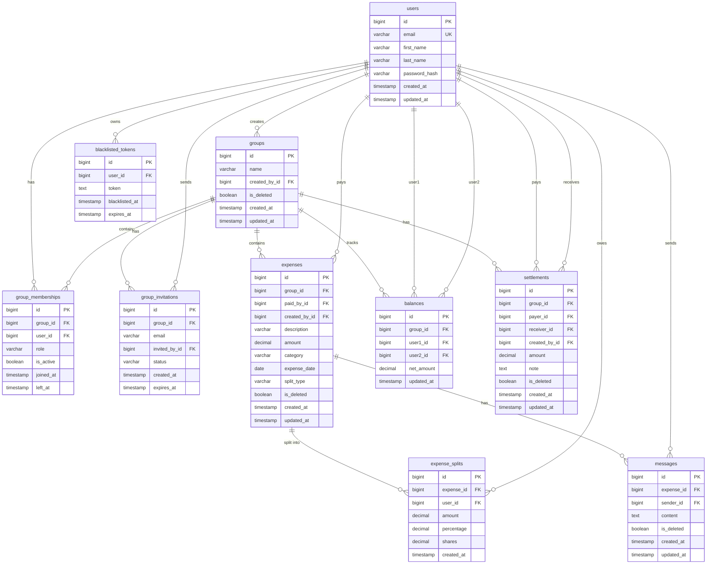

# AI_CONTEXT.md — Splitwise Clone: Source of Truth

> **IMPORTANT:** This document is the single source of truth for this project.
> It must be updated after every significant action. Another developer or AI
> must be able to recreate an almost identical application using this document alone.

---

## 1. Product Understanding

### What is Splitwise?
Splitwise is a shared expense management application that acts as a digital ledger between people who share costs. It tracks who paid for what, calculates who owes whom, and reduces the social awkwardness of asking for money back.

### Why Users Use It
- To fairly split recurring household costs (rent, utilities, groceries)
- To manage group travel expenses where different people pay for different things
- To settle one-off shared costs among friends (meals, gifts, tickets)
- To minimize the number of actual transactions needed to settle a group's debts

### Core Value Proposition
Splitwise automates the math of shared expenses so people can focus on their relationships, not their spreadsheets. It converts complex multi-person debt webs into the minimum number of payments needed to settle everything.

---

## 2. Splitwise Reverse Engineering

### User Journeys

**Journey 1 — Roommate paying rent:**
Register → Create group "Flat 4B" → Add members → Add monthly expense "Rent $3000" → Equal split → View balances → Each roommate settles up → Repeat monthly

**Journey 2 — Group travel:**
Register → Create group "Goa Trip" → Add friends → Multiple members add different expenses (hotel, food, transport) → View who owes what → Use simplified debt view → Settle up at trip end

**Journey 3 — Casual friend expense:**
Register → Add expense without group → Split with one friend → Friend views balance → Settles up

### Core Workflows
1. Register / Login → Dashboard with balance summary
2. Create Group → Invite members by email
3. Add Expense → Choose payer → Select split type → Save
4. View Group Detail → See expense list + member balances
5. Discuss expense → Real-time chat on each expense
6. Settle debt → Record payment → Balance updates instantly
7. View history → Audit trail of all expenses and settlements

### Screens Identified
| Screen | Route | Purpose |
|---|---|---|
| Login | /login | Auth |
| Register | /register | Auth |
| Dashboard | /dashboard | Global balance overview + group list |
| Groups List | /groups | All user groups |
| Group Detail | /groups/:id | Members, expenses, group balances |
| Expense Detail | /groups/:gid/expenses/:eid | Expense info + chat thread |
| Balances | /groups/:gid/balances | Group-level raw + simplified balances |
| Settlement History | /groups/:gid/settlements | All settlements in group |

### Core Entities Identified
User, Group, GroupMembership, GroupInvitation, Expense, ExpenseSplit, Balance (cached), Settlement, Message

### Product Assumptions
- One payer per expense (no multi-payer expenses)
- All monetary amounts in a single currency (INR/USD, no multi-currency)
- No payment gateway integration; settlements are manually recorded
- No push notifications; real-time only via WebSocket on chat

---

## 3. Scope Definition

### MVP Features (In Scope)
- User registration and login with JWT
- Group creation, viewing, inviting, adding, removing members
- Expense CRUD with all four split types
- Expense chat (real-time, persisted, per-expense thread)
- Cached balance table (raw + simplified views)
- Settlements (record, edit, delete, history)
- Relational database with proper normalization
- Deployment: Vercel + Render + Neon + Upstash Redis

### Out-of-Scope Features
- Multi-currency support
- Receipt scanning / OCR
- Recurring/scheduled expenses
- Push notifications or email alerts
- Mobile native app (iOS/Android)
- Payment gateway (Venmo, PayPal, UPI)
- Forgot password / email verification
- Group-level chat (only per-expense chat)
- Message editing
- Read receipts

### Edge Cases Documented
- Equal split remainder → assigned to payer
- Unequal split amounts not matching total → validation error
- Percentage split not summing to 100±0.01% → validation error
- Zero shares allowed in shares split
- Expense participant can be subset of group members
- Payer can also be a split participant
- Group deletion only allowed when all balances are zero (soft delete)
- Removed member's historical data preserved

---

## 4. Functional Requirements

### Authentication
- FR-AUTH-01: User can register with first_name, last_name, email, password
- FR-AUTH-02: Password must be ≥8 chars, contain uppercase, lowercase, digit
- FR-AUTH-03: Email must be unique across all users
- FR-AUTH-04: User receives access token (60 min) + refresh token (7 days) on login
- FR-AUTH-05: Access token stored in localStorage; refresh token in httpOnly cookie if feasible
- FR-AUTH-06: User can logout; refresh token is blacklisted on backend
- FR-AUTH-07: All non-auth endpoints require valid JWT access token
- FR-AUTH-08: Access token can be refreshed using refresh token

### Groups
- FR-GRP-01: Any authenticated user can create a group
- FR-GRP-02: Creator is automatically added as admin member
- FR-GRP-03: Admin can invite user by email (immediate add if exists; pending invitation if not)
- FR-GRP-04: Admin can remove members (historical data preserved)
- FR-GRP-05: Admin can rename group
- FR-GRP-06: Admin can delete group only if all balances are zero (soft delete)
- FR-GRP-07: Maximum 100 members per group
- FR-GRP-08: Removed user can be re-added
- FR-GRP-09: Any member can view group, expenses, and balances
- FR-GRP-10: Any member can add expenses and record settlements

### Expenses
- FR-EXP-01: Any active member can create an expense in their group
- FR-EXP-02: Expense requires: description, amount, category, date, paid_by, split_type, participants + split data
- FR-EXP-03: Expense creator or group admin can edit/delete an expense
- FR-EXP-04: Editing or deleting an expense triggers immediate balance recalculation
- FR-EXP-05: Amount must be >0 and ≤999999.99 with max 2 decimal places
- FR-EXP-06: Backdating allowed; date is required
- FR-EXP-07: Categories: Food, Travel, Utilities, Entertainment, Shopping, Other
- FR-EXP-08: Expense list supports filtering by date range, category, payer, amount range, description search
- FR-EXP-09: Expense list sorted newest first, paginated (default 20 per page)

### Split Types
- FR-SPL-01 (Equal): Total ÷ N participants; remainder assigned to payer
- FR-SPL-02 (Unequal): Manual amounts entered per participant; must sum exactly to total (validated server-side)
- FR-SPL-03 (Percentage): Percentages per participant; must sum to 100 ±0.01% (validated server-side)
- FR-SPL-04 (Shares): Integer shares per participant; 0 shares allowed; amount = (shares/total_shares) × total
- FR-SPL-05: Split can involve a subset of group members
- FR-SPL-06: Payer may be included as a split participant

### Balances
- FR-BAL-01: Cached balance table updated inside DB transaction on every expense/settlement change
- FR-BAL-02: Raw balances show per-expense debt breakdown
- FR-BAL-03: Simplified balances show minimum transactions to settle all debts in a group
- FR-BAL-04: UI defaults to simplified view with toggle to raw view
- FR-BAL-05: Dashboard shows both per-group and global (cross-group) net balance
- FR-BAL-06: Balances are scoped per group; global view aggregates across groups

### Settlements
- FR-SET-01: Any active member can record a settlement (payer → receiver)
- FR-SET-02: Settlement creator or group admin can edit/delete a settlement
- FR-SET-03: Partial settlements allowed (amount ≤ outstanding debt)
- FR-SET-04: Settlement is a separate entity (not modeled as expense)
- FR-SET-05: Settlement creation/edit/deletion triggers immediate balance recalculation
- FR-SET-06: Settlement history screen exists per group

### Chat
- FR-CHT-01: Each expense has its own chat thread
- FR-CHT-02: Messages are text-only, max 1000 characters
- FR-CHT-03: Messages update in real-time via WebSocket without page refresh
- FR-CHT-04: Chat history persists in database
- FR-CHT-05: Initial load shows latest 50 messages; older messages paginated
- FR-CHT-06: Sender can soft-delete their own message
- FR-CHT-07: Message editing is not allowed

---

## 5. Non-Functional Requirements

- NFR-01: API response time < 500ms for all non-real-time endpoints under normal load
- NFR-02: All financial calculations use Python `Decimal` type (no floating point)
- NFR-03: All balance updates wrapped in atomic DB transactions
- NFR-04: API rate limiting: 100 requests/hour per authenticated user (DRF throttling)
- NFR-05: All endpoints require authentication except /register and /login
- NFR-06: Application is fully mobile responsive (desktop-first)
- NFR-07: Frontend uses React + TypeScript for type safety
- NFR-08: All secrets stored in environment variables, never committed to repo
- NFR-09: Concurrent writes handled via DB transactions; last successful write wins (documented limitation)
- NFR-10: WebSocket authentication via JWT token passed as query parameter

---

## 6. User Personas

### Persona 1 — "The Roommate" (Riya, 24)
- Lives with 3 others; manages rent, utilities, groceries monthly
- Needs: recurring split tracking, clear audit trail, easy settle-up
- Pain points: remembering who paid last, awkward money conversations

### Persona 2 — "The Traveler" (Arjun, 28)
- Goes on group trips 3–4 times a year; 5–10 people per trip
- Needs: fast expense entry, simplified debt view, settle everything at trip end
- Pain points: complex web of who owes whom across many expenses

### Persona 3 — "The Social Friend" (Priya, 26)
- Splits bills occasionally at restaurants, events, shared gifts
- Needs: quick expense creation, minimal friction, see balance at a glance
- Pain points: forgetting small debts, not wanting to be the one who asks

---

## 7. User Stories

- US-01: As a user, I can register with my name, email, and password so that I can access the app.
- US-02: As a user, I can log in with my email and password and receive a JWT so that I can use protected features.
- US-03: As a user, I can log out so that my session is invalidated.
- US-04: As a user, I can create a group with a name so that I can manage shared expenses.
- US-05: As a group admin, I can invite a person by email so that they join my group.
- US-06: As a group admin, I can remove a member so that they can no longer add expenses.
- US-07: As a group admin, I can rename or delete the group (if balances are zero).
- US-08: As a group member, I can add an expense with description, amount, date, category, and split type.
- US-09: As an expense creator or admin, I can edit or delete an expense.
- US-10: As a group member, I can view a list of all expenses filtered by date, category, payer, or amount.
- US-11: As a group member, I can view my balance with each other member in a group.
- US-12: As a group member, I can toggle between raw balances and simplified (minimized) balances.
- US-13: As a group member, I can record a settlement payment to reduce my debt.
- US-14: As a settlement creator or admin, I can edit or delete a settlement.
- US-15: As a group member, I can view the settlement history for a group.
- US-16: As a group member, I can send a message in the chat thread of a specific expense.
- US-17: As a message sender, I can soft-delete my own message.
- US-18: As a user, I can see my global balance across all groups on the dashboard.

---

## 8. Acceptance Criteria

### AC for US-01 (Register)
- Given valid input, a user record is created and tokens are returned.
- Given duplicate email, response is 400 with error "Email already in use."
- Given password < 8 chars or missing uppercase/lowercase/digit, response is 400 with descriptive error.

### AC for US-04 (Create Group)
- Given a name, group is created with creator as admin member.
- Group appears in creator's group list immediately.

### AC for US-05 (Invite Member)
- If email exists: user added as active member immediately; response 200.
- If email not found: pending invitation created; response 201 with status="pending".
- If group is at 100 members: response 400 "Group member limit reached."

### AC for US-08 (Add Expense — Equal Split)
- $10 split equally among 3: each owes $3.33; remainder $0.01 added to payer's share (payer owes $3.34 less net).
- Balance table updated atomically within same transaction.

### AC for US-08 (Add Expense — Unequal Split)
- If split amounts sum ≠ total: response 400 "Split amounts must equal total expense amount."

### AC for US-08 (Add Expense — Percentage Split)
- If percentages sum outside 99.99–100.01: response 400 "Percentages must sum to 100%."

### AC for US-11 (View Balances)
- Raw view: shows exact debt between each pair of users from expense records.
- Simplified view: shows minimum transactions to clear all group debts.
- Both views accurate immediately after any expense or settlement change.

### AC for US-16 (Chat)
- Message appears in all connected clients' chat windows within 1 second of sending.
- Message persists in DB and is visible on page reload.
- Soft-deleted messages show as "[deleted]" placeholder.

---

## 9. Tech Stack Decisions

| Layer | Technology | Reason |
|---|---|---|
| Frontend Framework | React 18 + TypeScript | Component reuse, type safety, assignment spec |
| Frontend Styling | TailwindCSS | Utility-first, rapid responsive design, assignment spec |
| Frontend State | Zustand | Lightweight, simple auth/UI state management |
| Frontend Data Fetching | TanStack Query (React Query v5) | Caching, background refresh, pagination support |
| Frontend Routing | React Router v6 | Industry standard SPA routing |
| Backend Framework | Django 5 + Django REST Framework | Assignment spec; mature, batteries-included |
| Real-Time | Django Channels 4 | Assignment spec; WebSocket support on Django |
| Database | PostgreSQL (Neon) | Assignment spec; relational, ACID compliant |
| Cache / Message Broker | Redis (Upstash) | Required by Django Channels; Upstash free tier fits deployment |
| Auth | djangorestframework-simplejwt | Production-grade JWT for DRF |
| CORS | django-cors-headers | Required for Vite dev server + Vercel frontend |
| Filtering | django-filter | Declarative filtering on DRF viewsets |
| Frontend Build | Vite | Fast dev server, optimized production build |
| Deployment — Frontend | Vercel | Assignment spec |
| Deployment — Backend | Render | Assignment spec |
| Deployment — DB | Neon PostgreSQL | Assignment spec |
| Deployment — Redis | Upstash Redis | Assignment spec |

---

## 10. Architecture Decisions

### AD-01: Cached Balance Table
**Decision:** Maintain a `balances` table (cached) updated transactionally.
**Reason:** Computing balances on-the-fly from expense splits is O(n) per query and grows slow with large groups. Caching trades storage for read performance.
**Trade-off:** Balance updates must always happen inside DB transactions to prevent inconsistency.

### AD-02: Balance Representation
**Decision:** `Balance(group_id, user1_id, user2_id, net_amount)` where `user1_id < user2_id` always.
- `net_amount > 0` → user2 owes user1 that amount
- `net_amount < 0` → user1 owes user2 the absolute amount
**Reason:** Enforcing user1_id < user2_id ensures exactly one row per pair per group, preventing duplicate/conflicting rows.

### AD-03: Settlements as Separate Entity
**Decision:** Settlements are NOT modeled as expenses.
**Reason:** Settlements have different business logic (no split types, affect balances differently), and mixing them with expenses would require messy type-flag filtering.

### AD-04: Soft Deletes
**Decision:** Groups, Expenses, Settlements, and Messages use `is_deleted` flag; records are never physically removed.
**Reason:** Audit trail preservation; balance recalculation can always trace history.

### AD-05: Monorepo Structure
**Decision:** Single GitHub repo with `/frontend` and `/backend` subdirectories.
**Reason:** Simpler for assignment submission; shared README/docs at root.

### AD-06: WebSocket Authentication
**Decision:** JWT access token passed as `?token=` query parameter on WebSocket handshake.
**Reason:** Browser WebSocket API does not support custom headers; query param is the standard workaround.
**Trade-off:** Token briefly visible in server logs; acceptable for this assignment scope.

### AD-07: Balance Simplification Algorithm
**Decision:** Greedy min-flow algorithm (not true minimum-cost flow).
**Reason:** True min-cost flow is NP-hard for large n. Greedy (sort creditors and debtors, pair largest) produces near-optimal results and runs in O(n log n). Acceptable for groups ≤ 100.

---

## 11. Database Design

### Entity Descriptions

| Table | Description |
|---|---|
| `users` | Registered user accounts |
| `groups` | Shared expense groups |
| `group_memberships` | Many-to-many user ↔ group with role + active status |
| `group_invitations` | Pending invitations for non-registered emails |
| `expenses` | Individual expenses within a group |
| `expense_splits` | Per-user share of each expense |
| `balances` | Cached net debt between each user pair per group |
| `settlements` | Recorded payment transactions between two users |
| `messages` | Chat messages tied to a specific expense |
| `blacklisted_tokens` | Invalidated JWT refresh tokens |

### ER Diagram



### Constraints

| Table | Constraint |
|---|---|
| `users.email` | UNIQUE |
| `group_memberships` | UNIQUE(group_id, user_id) |
| `balances` | UNIQUE(group_id, user1_id, user2_id); CHECK(user1_id < user2_id) |
| `expenses.amount` | CHECK(amount > 0 AND amount <= 999999.99) |
| `settlements.amount` | CHECK(amount > 0) |
| `messages.content` | CHECK(length <= 1000) |
| `expense_splits` | SUM(amount) per expense must equal expense.amount (enforced in service layer) |

### Indexing Decisions

| Index | Reason |
|---|---|
| `expenses(group_id, expense_date DESC)` | Most common query: list expenses in group sorted by date |
| `expenses(group_id, paid_by_id)` | Filtering by payer |
| `expenses(group_id, category)` | Filtering by category |
| `expense_splits(expense_id)` | Fetching all splits for an expense |
| `expense_splits(user_id)` | Fetching all splits for a user |
| `balances(group_id, user1_id, user2_id)` | Balance lookup by pair |
| `balances(group_id, user1_id)` + `(group_id, user2_id)` | Fetching all balances for a user in a group |
| `messages(expense_id, created_at DESC)` | Fetching paginated chat history |
| `settlements(group_id, created_at DESC)` | Settlement history |
| `group_memberships(group_id, user_id)` | Member lookup |
| `blacklisted_tokens(token)` | Token blacklist lookup on every authenticated request |

---

## 12. Expense Algorithms

### Equal Split
```
total = Decimal(expense.amount)
n = len(participants)
base_share = (total / n).quantize(Decimal('0.01'), rounding=ROUND_DOWN)
remainder = total - (base_share * n)

splits = []
for i, participant in enumerate(participants):
    if participant.id == payer.id:
        # Assign remainder to payer
        splits.append(Split(user=participant, amount=base_share + remainder))
    else:
        splits.append(Split(user=participant, amount=base_share))
```
Example: $10 among 3 people → $3.33 + $3.33 + $3.34 (payer gets the extra $0.01)

### Unequal Split (Exact Amounts)
```
total = Decimal(expense.amount)
submitted_amounts = [Decimal(s['amount']) for s in split_data]
if sum(submitted_amounts) != total:
    raise ValidationError("Split amounts must equal total expense amount.")
splits = [Split(user_id=s['user_id'], amount=s['amount']) for s in split_data]
```

### Percentage Split
```
total = Decimal(expense.amount)
submitted_percentages = [Decimal(s['percentage']) for s in split_data]
total_pct = sum(submitted_percentages)
if not (Decimal('99.99') <= total_pct <= Decimal('100.01')):
    raise ValidationError("Percentages must sum to 100%.")

splits = []
computed_sum = Decimal('0.00')
for i, s in enumerate(split_data):
    if i == len(split_data) - 1:
        # Last participant gets the remainder to avoid rounding drift
        amount = total - computed_sum
    else:
        amount = (Decimal(s['percentage']) / 100 * total).quantize(Decimal('0.01'))
        computed_sum += amount
    splits.append(Split(user_id=s['user_id'], amount=amount, percentage=s['percentage']))
```

### Shares Split
```
total = Decimal(expense.amount)
total_shares = sum(Decimal(s['shares']) for s in split_data)
if total_shares == 0:
    raise ValidationError("Total shares must be greater than zero.")

splits = []
computed_sum = Decimal('0.00')
for i, s in enumerate(split_data):
    if i == len(split_data) - 1:
        amount = total - computed_sum
    else:
        amount = (Decimal(s['shares']) / total_shares * total).quantize(Decimal('0.01'))
        computed_sum += amount
    splits.append(Split(user_id=s['user_id'], amount=amount, shares=s['shares']))
```
Note: Participants with 0 shares receive a $0.00 split (they owe nothing for this expense).

---

## 13. Balance Algorithms

### Balance Update on Expense Create
```
For each split participant X (excluding payer P):
  owe_amount = split.amount  # X owes P this amount

  # Enforce user1_id < user2_id
  if P.id < X.id:
    user1, user2 = P, X
    delta = +owe_amount   # X=user2 owes P=user1 more
  else:
    user1, user2 = X, P
    delta = -owe_amount   # X=user1 owes P=user2 more (negative means user1 owes user2)

  balance = Balance.get_or_create(group=group, user1=user1, user2=user2)
  balance.net_amount += delta
  balance.save()
```

### Balance Update on Expense Delete / Edit
- On **delete**: reverse the balance deltas (apply negative of what was added on create)
- On **edit**: reverse old splits' effect, then apply new splits' effect — all in one transaction

### Balance Update on Settlement Create
```
# Payer P settles amount A with Receiver R (P pays R)
# P's debt to R decreases by A

if R.id < P.id:
    user1, user2 = R, P
    delta = +A   # P=user2's debt to R=user1 decreases → net_amount increases (more owed to R)
    # Wait: P paying R means P's debt decreases, so the "user2 owes user1" amount decreases
    delta = -A
else:
    user1, user2 = P, R
    delta = +A   # user1=P owes user2=R less → net_amount (which is negative showing P owes R) increases toward 0
    # net_amount < 0 means user1 owes user2. Settlement by P reduces this. net_amount += A (toward 0)

# Simplified:
if P.id < R.id:
    # user1=P, user2=R; net_amount < 0 means P owes R
    # P paying A reduces debt: net_amount += A
    delta = +A
else:
    # user1=R, user2=P; net_amount > 0 means P=user2 owes R=user1
    # P paying A reduces debt: net_amount -= A
    delta = -A

balance.net_amount += delta
```

### Debt Simplification Algorithm (Greedy)
```python
def simplify_debts(balances: list[Balance]) -> list[tuple]:
    """
    Input: list of Balance objects for a group
    Output: list of (debtor_id, creditor_id, amount) simplified transactions
    """
    # Build net balance per user
    net = {}  # user_id -> net amount (positive = is owed, negative = owes)
    for b in balances:
        # b.net_amount > 0 means user2 owes user1
        net[b.user1_id] = net.get(b.user1_id, 0) + b.net_amount
        net[b.user2_id] = net.get(b.user2_id, 0) - b.net_amount

    creditors = sorted([(amt, uid) for uid, amt in net.items() if amt > 0], reverse=True)
    debtors   = sorted([(abs(amt), uid) for uid, amt in net.items() if amt < 0], reverse=True)

    transactions = []
    i, j = 0, 0
    while i < len(creditors) and j < len(debtors):
        credit_amt, creditor = creditors[i]
        debt_amt, debtor = debtors[j]
        settle = min(credit_amt, debt_amt)
        transactions.append((debtor, creditor, settle))
        creditors[i] = (credit_amt - settle, creditor)
        debtors[j]   = (debt_amt - settle, debtor)
        if creditors[i][0] == 0: i += 1
        if debtors[j][0]   == 0: j += 1

    return transactions
```

### How Settlements Affect Balances
- Settlement of $A from user P to user R directly updates the `balances` row for the (P, R) pair in the group.
- Does NOT create expense splits. No recalculation of expense records.
- If settlement makes `net_amount` cross zero (P overpays), the balance flips sign — now R owes P the difference.

---

## 14. Authentication Design

### Registration Flow
1. POST /api/auth/register/ with {first_name, last_name, email, password}
2. Server validates: unique email, password rules
3. Django creates User with hashed password (PBKDF2)
4. Server returns access token + sets refresh token in httpOnly cookie (fallback: refresh in response body)
5. Frontend stores access token in localStorage

### Login Flow
1. POST /api/auth/login/ with {email, password}
2. Server validates credentials
3. Returns access token (60 min) + refresh token (7 days)
4. Frontend stores access token in localStorage

### Token Refresh Flow
1. When API call returns 401, frontend interceptor fires
2. POST /api/auth/token/refresh/ with refresh token (from cookie or localStorage)
3. Server validates refresh token is not blacklisted + not expired
4. Returns new access token
5. Frontend retries original request with new token

### Logout Flow
1. POST /api/auth/logout/ with refresh token
2. Server adds refresh token to `blacklisted_tokens` table
3. Frontend clears localStorage (access token) and cookie (refresh token)

### Protected Routes (Frontend)
- React Router's `<ProtectedRoute>` component checks Zustand auth store
- If no access token → redirect to /login
- After login → redirect to originally requested page

### Token Storage Decision
- Access Token: localStorage (XSS risk documented; acceptable for assignment)
- Refresh Token: httpOnly cookie (prevents JS access; CSRF mitigated via SameSite=Strict)
- If httpOnly cookie infeasible on deployment: both in localStorage (documented tradeoff)

### Trade-off Documentation
- localStorage access tokens are vulnerable to XSS attacks. In production, consider moving both tokens to httpOnly cookies with CSRF protection. For this assignment, localStorage is used for simplicity.

---

## 15. API Design

> Every endpoint listed below includes: Route, Method, Request, Response, Authorization, Validation, Error Responses.

### Base URL
- Development: `http://localhost:8000/api/`
- Production: `https://<render-app>.onrender.com/api/`

### Standard Error Format
```json
{ "error": "Human-readable message", "details": { "field": ["error"] } }
```

### Standard Pagination Response
```json
{ "count": 100, "next": "url", "previous": "url", "results": [] }
```

---

### AUTH ENDPOINTS

#### POST /api/auth/register/
- **Auth:** None
- **Request:** `{ first_name, last_name, email, password }`
- **Validation:** email unique; password ≥8 chars, 1 upper, 1 lower, 1 digit
- **Response 201:** `{ user: {id,email,first_name,last_name}, access_token, refresh_token }`
- **Errors:** 400 email duplicate | 400 password invalid

#### POST /api/auth/login/
- **Auth:** None
- **Request:** `{ email, password }`
- **Response 200:** `{ user: {...}, access_token, refresh_token }`
- **Errors:** 401 invalid credentials

#### POST /api/auth/logout/
- **Auth:** Bearer access token
- **Request:** `{ refresh_token }` (body)
- **Response 200:** `{ message: "Logged out successfully." }`
- **Errors:** 400 missing token | 400 token already blacklisted

#### POST /api/auth/token/refresh/
- **Auth:** None
- **Request:** `{ refresh }` (body)
- **Response 200:** `{ access }` (new access token)
- **Errors:** 401 token invalid/expired/blacklisted

#### GET /api/auth/me/
- **Auth:** Bearer access token
- **Response 200:** `{ id, email, first_name, last_name, created_at }`
- **Errors:** 401 unauthenticated

---

### GROUP ENDPOINTS

#### GET /api/groups/
- **Auth:** Bearer token
- **Response 200:** Paginated list of groups user is an active member of
  ```json
  { "results": [{ "id", "name", "member_count", "created_by", "role", "created_at" }] }
  ```

#### POST /api/groups/
- **Auth:** Bearer token
- **Request:** `{ name }` (1–100 chars)
- **Response 201:** `{ id, name, created_by, members: [{ user, role }], created_at }`
- **Errors:** 400 name too long | 400 name empty

#### GET /api/groups/{id}/
- **Auth:** Bearer token; must be active member
- **Response 200:** `{ id, name, created_by, members: [...], created_at, updated_at }`
- **Errors:** 403 not a member | 404 group not found

#### PATCH /api/groups/{id}/
- **Auth:** Bearer token; must be group admin
- **Request:** `{ name }` (partial update)
- **Response 200:** Updated group object
- **Errors:** 403 not admin | 404 not found

#### DELETE /api/groups/{id}/
- **Auth:** Bearer token; must be group admin
- **Validation:** All balances in group must be zero
- **Response 200:** `{ message: "Group deleted." }` (soft delete)
- **Errors:** 400 unsettled balances exist | 403 not admin

#### GET /api/groups/{id}/members/
- **Auth:** Bearer token; must be active member
- **Response 200:** `[{ user: {...}, role, is_active, joined_at }]`

#### POST /api/groups/{id}/invite/
- **Auth:** Bearer token; must be group admin
- **Request:** `{ email }`
- **Validation:** Group < 100 members; user not already active member
- **Response 200 (existing user):** `{ message: "User added.", member: {...} }`
- **Response 201 (pending):** `{ message: "Invitation pending.", invitation: {...} }`
- **Errors:** 400 member limit | 400 already member | 403 not admin

#### DELETE /api/groups/{id}/members/{user_id}/
- **Auth:** Bearer token; must be group admin
- **Validation:** Cannot remove yourself if you are the only admin
- **Response 200:** `{ message: "Member removed." }` (sets is_active=False)
- **Errors:** 400 cannot remove last admin | 403 not admin | 404 member not found

---

### EXPENSE ENDPOINTS

#### GET /api/groups/{group_id}/expenses/
- **Auth:** Bearer token; must be active member
- **Query params:** `page`, `page_size`, `date_from`, `date_to`, `category`, `paid_by`, `amount_min`, `amount_max`, `search` (description)
- **Response 200:** Paginated list, sorted by expense_date DESC
  ```json
  { "results": [{ "id","description","amount","category","expense_date","paid_by","split_type","created_by","splits":[...] }] }
  ```

#### POST /api/groups/{group_id}/expenses/
- **Auth:** Bearer token; must be active member
- **Request:**
  ```json
  {
    "description": "Dinner",
    "amount": "150.00",
    "category": "Food",
    "expense_date": "2025-06-14",
    "paid_by": 3,
    "split_type": "equal",
    "splits": [
      { "user_id": 3 },
      { "user_id": 5 },
      { "user_id": 7 }
    ]
  }
  ```
- **Validation:** amount >0 ≤999999.99; paid_by is active member; all split user_ids are active members; split amounts valid per split_type rules
- **Response 201:** Full expense object with splits
- **Side Effect:** Balance table updated atomically in same DB transaction
- **Errors:** 400 validation | 403 not member | 404 group not found

#### GET /api/groups/{group_id}/expenses/{id}/
- **Auth:** Bearer token; must be active member
- **Response 200:** Full expense object with splits + message thread preview

#### PATCH /api/groups/{group_id}/expenses/{id}/
- **Auth:** Bearer token; must be expense creator or group admin
- **Request:** Same structure as POST (partial or full)
- **Response 200:** Updated expense object
- **Side Effect:** Old balance deltas reversed, new deltas applied — atomically
- **Errors:** 400 validation | 403 unauthorized | 404 not found

#### DELETE /api/groups/{group_id}/expenses/{id}/
- **Auth:** Bearer token; must be expense creator or group admin
- **Response 200:** `{ message: "Expense deleted." }` (soft delete)
- **Side Effect:** Balance deltas reversed atomically
- **Errors:** 403 unauthorized | 404 not found

---

### BALANCE ENDPOINTS

#### GET /api/groups/{group_id}/balances/
- **Auth:** Bearer token; must be active member
- **Query params:** `view=raw|simplified` (default: `simplified`)
- **Response 200 (simplified):**
  ```json
  {
    "view": "simplified",
    "transactions": [
      { "debtor": {...}, "creditor": {...}, "amount": "30.00" }
    ]
  }
  ```
- **Response 200 (raw):**
  ```json
  {
    "view": "raw",
    "balances": [
      { "user1": {...}, "user2": {...}, "net_amount": "30.00", "description": "user2 owes user1 $30.00" }
    ]
  }
  ```

#### GET /api/balances/
- **Auth:** Bearer token
- **Response 200:** Global balance summary across all groups
  ```json
  {
    "total_owed_to_you": "120.00",
    "total_you_owe": "45.00",
    "net": "75.00",
    "by_group": [{ "group": {...}, "you_owe": "0.00", "owed_to_you": "75.00" }]
  }
  ```

---

### SETTLEMENT ENDPOINTS

#### GET /api/groups/{group_id}/settlements/
- **Auth:** Bearer token; must be active member
- **Query params:** `page`, `page_size`
- **Response 200:** Paginated list of settlements, newest first
  ```json
  { "results": [{ "id","payer","receiver","amount","note","created_by","created_at" }] }
  ```

#### POST /api/groups/{group_id}/settlements/
- **Auth:** Bearer token; must be active member
- **Request:** `{ payer_id, receiver_id, amount, note (optional) }`
- **Validation:** payer ≠ receiver; amount >0; both are active members
- **Response 201:** Settlement object
- **Side Effect:** Balance updated atomically
- **Errors:** 400 payer=receiver | 400 amount invalid | 403 not member

#### GET /api/groups/{group_id}/settlements/{id}/
- **Auth:** Bearer token; must be active member
- **Response 200:** Settlement object

#### PATCH /api/groups/{group_id}/settlements/{id}/
- **Auth:** Bearer token; must be settlement creator or group admin
- **Request:** `{ amount, note }` (partial)
- **Response 200:** Updated settlement
- **Side Effect:** Old balance effect reversed, new applied atomically
- **Errors:** 403 unauthorized | 404 not found

#### DELETE /api/groups/{group_id}/settlements/{id}/
- **Auth:** Bearer token; must be settlement creator or group admin
- **Response 200:** `{ message: "Settlement deleted." }` (soft delete)
- **Side Effect:** Balance reversed atomically
- **Errors:** 403 unauthorized | 404 not found

---

### CHAT ENDPOINTS (REST — for history)

#### GET /api/expenses/{expense_id}/messages/
- **Auth:** Bearer token; must be member of expense's group
- **Query params:** `page`, `page_size=50`, `before_id` (for paginating older messages)
- **Response 200:**
  ```json
  { "results": [{ "id","sender","content","is_deleted","created_at" }], "has_more": true }
  ```

#### DELETE /api/expenses/{expense_id}/messages/{id}/
- **Auth:** Bearer token; must be message sender
- **Response 200:** `{ message: "Message deleted." }` (soft delete, sets is_deleted=True)
- **Side Effect:** WebSocket broadcast of deletion event to room
- **Errors:** 403 not sender | 404 not found

### WEBSOCKET — Chat

#### ws://<host>/ws/chat/{expense_id}/?token=<access_token>
- **Auth:** JWT token validated on connect; 403 if invalid or user not member
- **Connect:** Consumer joins Django Channels group `expense_{expense_id}`
- **Client → Server (send message):**
  ```json
  { "type": "chat.message", "content": "Hello!" }
  ```
- **Server → Client (new message broadcast):**
  ```json
  { "type": "chat.message", "id": 42, "sender": {...}, "content": "Hello!", "created_at": "..." }
  ```
- **Server → Client (delete broadcast):**
  ```json
  { "type": "chat.delete", "id": 42 }
  ```
- **Disconnect:** Consumer leaves group; no cleanup needed


---

## 16. Frontend Structure

### Folder Structure
```
frontend/
├── index.html
├── package.json
├── tsconfig.json
├── vite.config.ts
├── tailwind.config.ts
├── postcss.config.js
├── .env.example
├── public/
│   └── favicon.ico
└── src/
    ├── main.tsx               # App entry point
    ├── App.tsx                # Router setup
    ├── api/
    │   ├── client.ts          # Axios instance + interceptors (auto token refresh)
    │   ├── auth.ts            # register, login, logout, me, refresh
    │   ├── groups.ts          # CRUD + invite + members
    │   ├── expenses.ts        # CRUD + filtering
    │   ├── balances.ts        # group balances, global balances
    │   ├── settlements.ts     # CRUD
    │   └── messages.ts        # REST chat history + delete
    ├── components/
    │   ├── ui/
    │   │   ├── Button.tsx
    │   │   ├── Input.tsx
    │   │   ├── Modal.tsx
    │   │   ├── Card.tsx
    │   │   ├── Badge.tsx
    │   │   ├── Spinner.tsx
    │   │   ├── Avatar.tsx
    │   │   └── EmptyState.tsx
    │   ├── layout/
    │   │   ├── Navbar.tsx
    │   │   ├── Sidebar.tsx
    │   │   └── PageWrapper.tsx
    │   ├── groups/
    │   │   ├── GroupCard.tsx
    │   │   ├── GroupForm.tsx
    │   │   ├── MemberList.tsx
    │   │   └── InviteModal.tsx
    │   ├── expenses/
    │   │   ├── ExpenseCard.tsx
    │   │   ├── ExpenseForm.tsx    # Handles all 4 split types
    │   │   ├── SplitEditor.tsx    # Dynamic split input UI
    │   │   └── ExpenseFilters.tsx
    │   ├── balances/
    │   │   ├── BalanceCard.tsx
    │   │   └── BalanceToggle.tsx  # Raw vs Simplified toggle
    │   ├── settlements/
    │   │   ├── SettlementForm.tsx
    │   │   └── SettlementCard.tsx
    │   └── chat/
    │       ├── ChatWindow.tsx     # Full chat panel
    │       ├── MessageBubble.tsx  # Individual message
    │       └── MessageInput.tsx   # Text input + send button
    ├── pages/
    │   ├── LoginPage.tsx
    │   ├── RegisterPage.tsx
    │   ├── DashboardPage.tsx      # Global balances + group list
    │   ├── GroupsPage.tsx         # All groups
    │   ├── GroupDetailPage.tsx    # Members + expenses + group balance summary
    │   ├── ExpenseDetailPage.tsx  # Expense info + chat thread
    │   ├── BalancesPage.tsx       # Full balance view (raw/simplified toggle)
    │   └── SettlementHistoryPage.tsx
    ├── store/
    │   ├── authStore.ts           # Zustand: user, access_token, setAuth, logout
    │   └── uiStore.ts             # Zustand: active modals, toast notifications
    ├── hooks/
    │   ├── useAuth.ts             # Login, register, logout mutations
    │   ├── useGroups.ts           # Group queries and mutations
    │   ├── useExpenses.ts         # Expense queries and mutations
    │   ├── useBalances.ts         # Balance queries
    │   ├── useSettlements.ts      # Settlement queries and mutations
    │   └── useChat.ts             # WebSocket connection + message state
    ├── types/
    │   ├── auth.ts
    │   ├── group.ts
    │   ├── expense.ts
    │   ├── balance.ts
    │   ├── settlement.ts
    │   └── message.ts
    ├── utils/
    │   ├── formatters.ts          # formatCurrency, formatDate, formatRelativeTime
    │   ├── validators.ts          # Client-side validation helpers
    │   └── websocket.ts           # WebSocket manager class
    └── routes/
        ├── ProtectedRoute.tsx     # Redirects to /login if no token
        └── index.tsx              # Route definitions
```

### Routing Map
| Path | Component | Auth Required | Notes |
|---|---|---|---|
| `/` | Redirect | No | → /dashboard if logged in, else /login |
| `/login` | LoginPage | No | Redirect to /dashboard if already logged in |
| `/register` | RegisterPage | No | Redirect to /dashboard if already logged in |
| `/dashboard` | DashboardPage | Yes | Global balance + groups |
| `/groups` | GroupsPage | Yes | All groups list |
| `/groups/:groupId` | GroupDetailPage | Yes | Must be member |
| `/groups/:groupId/expenses/:expenseId` | ExpenseDetailPage | Yes | Must be member |
| `/groups/:groupId/balances` | BalancesPage | Yes | Must be member |
| `/groups/:groupId/settlements` | SettlementHistoryPage | Yes | Must be member |

### State Management
- **Zustand** (`authStore`): Stores `user` object and `access_token`. Persisted to localStorage. On app load, reads token from localStorage and validates.
- **TanStack Query**: All server state (groups, expenses, balances, settlements, messages). Automatic background refetch, cache invalidation on mutation.
- **Local component state**: Form inputs, modal open/close states managed with `useState`.

### Data Fetching Approach
- All API calls via centralized Axios `client.ts` with interceptors:
  1. Request interceptor: Attach `Authorization: Bearer <access_token>` header
  2. Response interceptor: On 401, attempt token refresh, retry original request. If refresh fails → logout

### WebSocket Approach (useChat hook)
- On `ExpenseDetailPage` mount: Open WebSocket connection to `ws://<backend>/ws/chat/{expenseId}/?token=<access_token>`
- On message received: Append to local message state
- On delete event received: Mark message as deleted in local state
- On page unmount: Close WebSocket connection
- Initial messages: Fetched via REST GET (latest 50); WebSocket only delivers new messages

---

## 17. Backend Structure

```
backend/
├── manage.py
├── requirements.txt
├── Procfile                    # web: daphne config.asgi:application
├── runtime.txt                 # python-3.12.x
├── .env.example
├── config/
│   ├── __init__.py
│   ├── settings/
│   │   ├── __init__.py
│   │   ├── base.py             # Common settings
│   │   ├── development.py      # DEBUG=True, SQLite fallback
│   │   └── production.py       # DEBUG=False, Neon PostgreSQL, Upstash Redis
│   ├── urls.py                 # Root URL configuration
│   ├── asgi.py                 # ASGI with Django Channels routing
│   └── wsgi.py
├── apps/
│   ├── authentication/
│   │   ├── models.py           # BlacklistedToken model
│   │   ├── serializers.py      # RegisterSerializer, LoginSerializer
│   │   ├── views.py            # RegisterView, LoginView, LogoutView, MeView
│   │   ├── urls.py
│   │   └── tests.py
│   ├── users/
│   │   ├── models.py           # Custom User model (AbstractBaseUser)
│   │   ├── serializers.py      # UserSerializer (read-only)
│   │   ├── managers.py         # UserManager
│   │   └── tests.py
│   ├── groups/
│   │   ├── models.py           # Group, GroupMembership, GroupInvitation
│   │   ├── serializers.py      # GroupSerializer, MemberSerializer, InvitationSerializer
│   │   ├── views.py            # GroupViewSet, MemberViewSet, InviteView
│   │   ├── urls.py
│   │   ├── permissions.py      # IsGroupAdmin, IsGroupMember
│   │   └── tests.py
│   ├── expenses/
│   │   ├── models.py           # Expense, ExpenseSplit
│   │   ├── serializers.py      # ExpenseSerializer, ExpenseSplitSerializer
│   │   ├── views.py            # ExpenseViewSet
│   │   ├── urls.py
│   │   ├── services.py         # calculate_splits(), validate_splits()
│   │   ├── filters.py          # ExpenseFilter (django-filter)
│   │   └── tests.py
│   ├── balances/
│   │   ├── models.py           # Balance
│   │   ├── serializers.py      # BalanceSerializer
│   │   ├── views.py            # GroupBalanceView, GlobalBalanceView
│   │   ├── urls.py
│   │   └── services.py         # update_balances_for_expense(), simplify_debts()
│   ├── settlements/
│   │   ├── models.py           # Settlement
│   │   ├── serializers.py      # SettlementSerializer
│   │   ├── views.py            # SettlementViewSet
│   │   ├── urls.py
│   │   └── tests.py
│   └── chat/
│       ├── models.py           # Message
│       ├── serializers.py      # MessageSerializer
│       ├── views.py            # MessageListView, MessageDeleteView
│       ├── urls.py
│       ├── consumers.py        # ChatConsumer (AsyncJsonWebsocketConsumer)
│       ├── routing.py          # WebSocket URL patterns
│       └── tests.py
└── utils/
    ├── permissions.py          # Shared permission classes
    ├── pagination.py           # StandardPagination (default 20, max 100)
    └── throttling.py           # UserRateThrottle (100/hour)
```

### Django Apps
| App | Responsibility |
|---|---|
| `authentication` | JWT register/login/logout/refresh, token blacklist |
| `users` | Custom User model, user lookup |
| `groups` | Group CRUD, memberships, invitations |
| `expenses` | Expense CRUD, split calculation service |
| `balances` | Cached balance reads, balance update service, simplification |
| `settlements` | Settlement CRUD, balance update trigger |
| `chat` | REST message history, WebSocket consumer |

### Key Services
- **`expenses.services.calculate_splits(expense, split_type, split_data)`**: Pure function; returns list of ExpenseSplit objects; raises ValidationError on invalid input
- **`balances.services.apply_expense_to_balances(expense, splits, operation)`**: operation = 'add' or 'reverse'; updates Balance table within caller's transaction
- **`balances.services.apply_settlement_to_balance(settlement, operation)`**: Updates balance for payer/receiver pair
- **`balances.services.simplify_debts(group_id)`**: Reads Balance table, runs greedy algorithm, returns transaction list (does not write to DB)

---

## 18. Real-Time Chat Design

### WebSocket Flow
```
1. Client opens: ws://<host>/ws/chat/{expense_id}/?token=<jwt>
2. ChatConsumer.connect():
   a. Extract token from query string
   b. Authenticate user via simplejwt token validation
   c. Verify user is active member of expense's group
   d. If invalid: self.close(code=4003)
   e. If valid: await self.channel_layer.group_add(f"expense_{expense_id}", self.channel_name)
               await self.accept()
3. Client sends: {"type": "chat.message", "content": "Hello!"}
4. ChatConsumer.receive_json():
   a. Validate content (non-empty, ≤1000 chars)
   b. Save Message to DB (async via database_sync_to_async)
   c. Broadcast to group: channel_layer.group_send(f"expense_{expense_id}", {...})
5. All connected clients receive: {"type": "chat.message", "id": ..., "sender": {...}, ...}
6. Client sends delete: {"type": "chat.delete", "message_id": 42}
7. ChatConsumer handles delete:
   a. Verify sender owns the message
   b. Soft-delete in DB
   c. Broadcast: {"type": "chat.delete", "id": 42}
8. Client disconnects: ChatConsumer.disconnect()
   a. channel_layer.group_discard(f"expense_{expense_id}", self.channel_name)
```

### Channel Layer
- **Layer:** Redis via `channels_redis` library
- **Connection:** Upstash Redis URL (TLS)
- **Group naming:** `expense_{expense_id}` (one channel group per expense)
- **Local dev:** Can use `channels.layers.InMemoryChannelLayer` (set in development.py)

### WebSocket Authentication
- Token passed as query param: `?token=<access_token>`
- Consumer extracts via `self.scope["query_string"]`
- Validated using `simplejwt.tokens.AccessToken(token)` — raises `TokenError` if invalid
- Blacklisted token check is NOT performed on WebSocket connect (access tokens are short-lived, 60 min; acceptable trade-off)

### Persistence
- Every message saved to `messages` table before broadcast
- `is_deleted=True` messages are soft-deleted; fetched as `{"content": "[deleted]", "is_deleted": true}`
- Initial chat history: REST endpoint GET /api/expenses/{id}/messages/ (latest 50, paginated)
- New messages after connect: WebSocket only

---

## 19. Testing Strategy

### Unit Tests (Backend)
- **Model tests** (`tests.py` in each app): Verify model constraints, string representations, custom methods
- **Split algorithm tests** (`expenses/tests.py`): Test all 4 split types with known inputs/outputs; test edge cases (remainder, zero shares, rounding)
- **Balance algorithm tests** (`balances/tests.py`): Test balance update on expense add/edit/delete; test simplification algorithm; test settlement effect

### API Tests (Backend)
- **Auth tests**: Register success, duplicate email, weak password, login success, login failure, token refresh, logout blacklist
- **Group tests**: Create, invite (existing/non-existing user), remove member, rename (admin only), delete (zero balance only)
- **Expense tests**: Create each split type, edit triggers balance recalculation, delete triggers reversal, filter/pagination
- **Balance tests**: Raw view accuracy, simplified view correctness after multiple expenses
- **Settlement tests**: Create partial, edit, delete, permission enforcement

### UI Tests (Frontend) — Manual verification scope
- Authentication flow (register → redirect to dashboard)
- Create group → invite member → member sees group
- Add expense (all 4 split types) → verify balance updates
- Settle debt → verify balance reflects payment
- Real-time chat: Two browser tabs, send message, verify instant delivery

### Test Runner
- Backend: `python manage.py test` (Django test runner with `--verbosity=2`)
- Test database: SQLite in-memory for speed (override in test settings)

---

## 20. Deployment Strategy

### Environment Variables

**Backend (.env):**
```
SECRET_KEY=<django-secret-key>
DEBUG=False
DATABASE_URL=postgresql://<user>:<pass>@<neon-host>/<db>?sslmode=require
REDIS_URL=rediss://:<pass>@<upstash-host>:6379
ALLOWED_HOSTS=<render-app>.onrender.com
CORS_ALLOWED_ORIGINS=https://<vercel-app>.vercel.app
ACCESS_TOKEN_LIFETIME_MINUTES=60
REFRESH_TOKEN_LIFETIME_DAYS=7
```

**Frontend (.env):**
```
VITE_API_BASE_URL=https://<render-app>.onrender.com/api
VITE_WS_BASE_URL=wss://<render-app>.onrender.com
```

### Frontend Deployment (Vercel)
1. Push monorepo to GitHub
2. Import repo into Vercel; set **Root Directory** to `frontend/`
3. Build command: `npm run build`; Output: `dist/`
4. Add env vars: `VITE_API_BASE_URL`, `VITE_WS_BASE_URL`
5. Vercel auto-deploys on every push to `main`

### Backend Deployment (Render)
1. Create new **Web Service** on Render; connect GitHub repo
2. Root directory: `backend/`; Build command: `pip install -r requirements.txt`
3. Start command: `daphne -b 0.0.0.0 -p $PORT config.asgi:application`
   - Daphne is required (not gunicorn) because Django Channels needs ASGI
4. Add all env vars from `.env` above
5. Run migrations via Render Shell: `python manage.py migrate`
6. Render auto-deploys on every push to `main`

### Database (Neon PostgreSQL)
1. Create project on neon.tech; copy connection string
2. Set `DATABASE_URL` in Render env vars
3. Neon provides managed PostgreSQL with free tier; SSL required (`?sslmode=require`)

### Redis (Upstash)
1. Create Redis database on upstash.com
2. Copy Redis URL (`rediss://` with TLS)
3. Set `REDIS_URL` in Render env vars

### Migration Flow
- `python manage.py makemigrations` (run locally)
- `python manage.py migrate` (run on Render after deploy)
- Migrations committed to repo

---

## 21. Risks

| Risk | Likelihood | Impact | Mitigation |
|---|---|---|---|
| Render free tier sleeps after inactivity (cold start ~30s) | High | Medium | Document in README; use UptimeRobot to ping |
| Upstash Redis free tier connection limits | Medium | High | Monitor; upgrade if needed |
| Neon free tier storage/connection limits | Low | High | Monitor usage; Neon generous on free tier |
| Balance inconsistency if transaction fails mid-way | Low | Critical | All balance updates in `atomic()` blocks |
| WebSocket auth token expiry during long chat session | Medium | Low | Frontend reconnects with fresh token on 4003 close |
| Concurrent balance update race condition | Low | High | DB-level row locking via `select_for_update()` in balance service |

---

## 22. Trade-offs

| Decision | Trade-off Made | Alternative |
|---|---|---|
| Cached balances | More complex update logic; potential inconsistency if transaction fails | On-the-fly calculation: simpler but slower |
| localStorage for access token | XSS vulnerability | httpOnly cookies with CSRF protection |
| Greedy simplification | Not always globally optimal | True min-cost flow (too complex for assignment) |
| Soft deletes everywhere | Storage grows over time | Hard delete with cascade |
| user1_id < user2_id balance constraint | Cannot store zero-amount rows for settled pairs | Separate debtor/creditor columns |
| SQLite for local dev | Slight differences from PostgreSQL decimal handling | Local PostgreSQL Docker container |
| Single admin per group (no multi-admin) | Less flexible for large groups | Admin role assignment |
| JWT in localStorage | Slightly less secure | httpOnly cookie |

---

## 23. Known Limitations

1. **Concurrent writes:** Last successful transaction wins. No optimistic locking UI. User is not notified of conflict.
2. **Token exposure:** Access token in localStorage is readable by JavaScript. Acceptable for assignment scope.
3. **WebSocket token expiry:** If a user's access token expires during an active WebSocket session, messages will still be received (WS connection already authenticated). New connection after expiry will fail until token is refreshed via REST and page is reloaded.
4. **Balance simplification is advisory:** The simplified view shows the optimal transactions to settle but does NOT automatically create settlements. Users must manually record each payment.
5. **No email notifications:** Users are not notified of new expenses or settlements added by others.
6. **Render free tier cold starts:** Backend may take ~30 seconds to respond after inactivity.

---

## 24. Future Improvements

- Multi-currency support with live exchange rates
- Email notifications on expense add/settlement
- Push notifications (PWA service worker)
- Receipt scanning via OCR
- Recurring expense templates
- Export expense history to PDF/CSV
- Multi-admin groups
- Mobile app (React Native)
- Payment gateway integration (Razorpay, Stripe)
- True minimum-cost flow for debt simplification
- Optimistic locking with conflict resolution UI
- Account merging (when a pending invite user registers)

---

## 25. Every Prompt Used

### Prompt 1 — Phase 1 Research (User → AI)
> "Research Splitwise as a product. Identify: Primary users, Main workflows, Important screens, Core entities, Business logic, Pain points solved, Critical features, Nice-to-have features. Present findings. Do not code."

### Prompt 2 — Discovery Interview (AI → User)
> AI conducted an 11-batch discovery interview covering: Authentication, Groups, Expenses, Split Types, Balances, Settlements, Chat, API Design, Frontend UX, Security, Deployment.

### Prompt 3 — Final Product Decisions (User → AI)
> User provided comprehensive approved requirements covering all 11 discovery areas as final product decisions with specific rules for every feature area.

---

## 26. Important AI Responses

### Response to Phase 1
- Identified 3 user personas: Roommate, Traveler, Social Friend
- Documented 5 core workflows and 8 screens
- Identified all core entities and the balance simplification algorithm
- Researched the Greedy debt minimization approach

### Architecture Decisions Made by AI (with rationale)
- Balance representation with `user1_id < user2_id` constraint
- Greedy O(n log n) simplification (vs NP-hard min-cost flow)
- WebSocket auth via query param (browser limitation)
- Daphne (not Gunicorn) for ASGI support on Render

---

## 27. Every Requirement Change
*(None yet — this section tracks changes from the original approved requirements)*

---

## 28. Every Architecture Change
*(None yet — this section tracks architectural pivots during implementation)*

---

## 28. Module 2 — Authentication Implementation Notes

### Files Created
| File | Purpose |
|---|---|
| `apps/users/serializers.py` | Read-only `UserSerializer` (reused across all apps) |
| `apps/authentication/models.py` | Intentionally empty — simplejwt's `token_blacklist` app handles blacklisting |
| `apps/authentication/serializers.py` | `RegisterSerializer`, `LoginSerializer`, `LogoutSerializer` |
| `apps/authentication/views.py` | `RegisterView`, `LoginView`, `LogoutView`, `TokenRefreshView`, `MeView` |
| `apps/authentication/urls.py` | 5 URL patterns at `/api/auth/` |
| `apps/authentication/tests.py` | 37 test cases across 5 test classes |

### Key Implementation Decisions

**AD-08: No custom BlacklistedToken model**
`rest_framework_simplejwt.token_blacklist` already provides `OutstandingToken` and `BlacklistedToken` tables. Using these directly avoids maintaining a duplicate table. Logout calls `RefreshToken(token_string).blacklist()`.

**AD-09: User enumeration protection**
`LoginSerializer` returns the same error message ("Invalid email or password") for both wrong password and non-existent email. This prevents attackers from discovering which emails are registered via error message differences.

**AD-10: Email normalisation**
Emails are lowercased and stripped in both `RegisterSerializer.validate_email()` and `LoginSerializer.validate()`. This makes the system case-insensitive at the application layer, consistent with email RFCs (domain part is case-insensitive).

**AD-11: Token response shape**
Both `/register/` and `/login/` return the same shape: `{user, access_token, refresh_token}`. The shared `_token_response()` helper enforces this consistency. Frontend can handle both endpoints with one response parser.

**AD-12: Access token not blacklisted on logout**
Only the refresh token is blacklisted on logout. Access tokens remain valid until they expire (60 min). This is a documented trade-off: blacklisting access tokens would require a DB or cache lookup on every single API request, destroying performance. The 60-minute window is the accepted security gap.

### Migration Commands
```bash
python manage.py makemigrations users
python manage.py migrate
# simplejwt token_blacklist migration is included in the above migrate command
```

### Test Execution
```bash
python manage.py test apps.authentication
# or
pytest apps/authentication/tests.py -v
```
