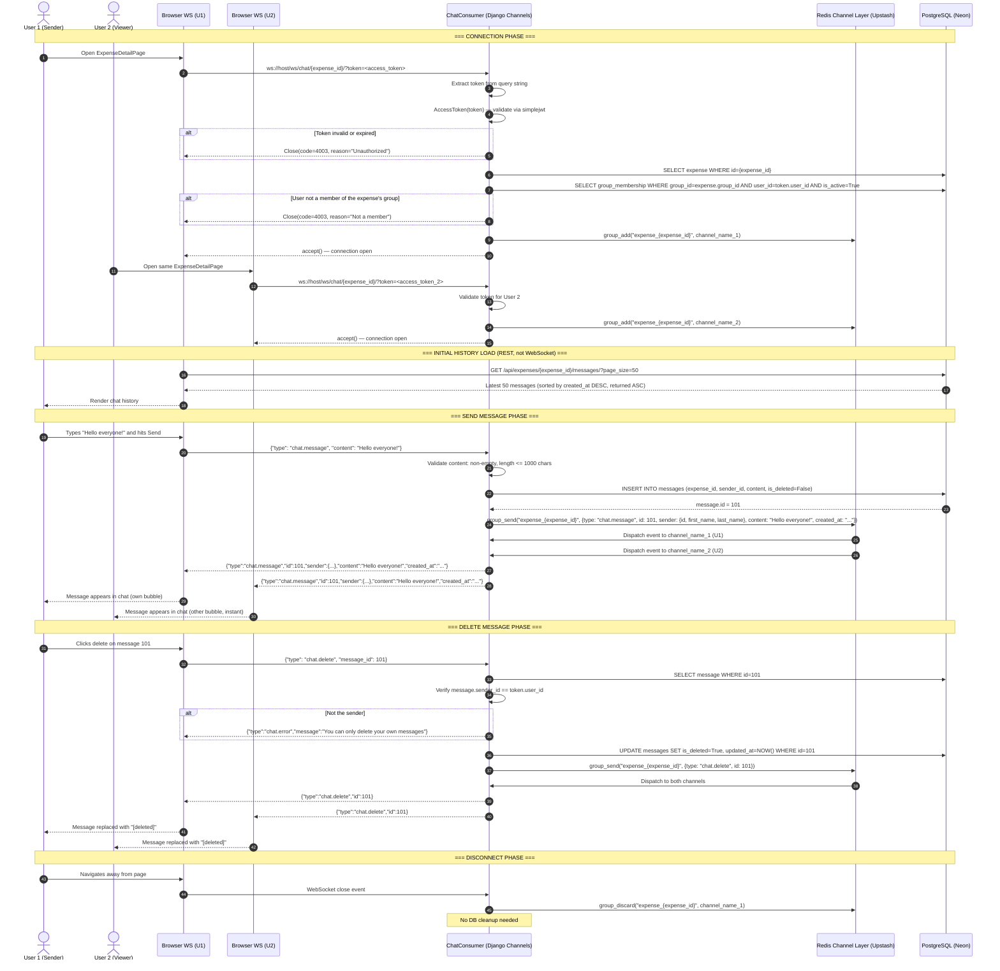
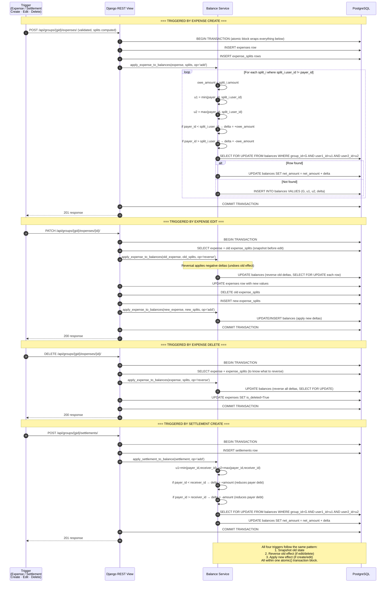

# Sequence Diagrams — Splitwise Clone

> All diagrams rendered in Mermaid. These represent the exact server-side and client-side flows for the four critical operations in the system.

---

## SD-01 — Add Expense

```mermaid
sequenceDiagram
    autonumber
    actor U as User (Browser)
    participant FE as React Frontend
    participant AX as Axios Client
    participant DRF as Django REST API
    participant SVC as Split Service
    participant BAL as Balance Service
    participant DB as PostgreSQL (Neon)

    U->>FE: Fills expense form (amount, split type, participants)
    FE->>FE: Client-side validation (amount > 0, participants selected)
    FE->>AX: POST /api/groups/{gid}/expenses/ {description, amount, category, expense_date, paid_by, split_type, splits[]}
    AX->>AX: Attach Authorization: Bearer <access_token>
    AX->>DRF: HTTP POST

    DRF->>DRF: Authenticate JWT token
    DRF->>DB: SELECT group WHERE id={gid} AND is_deleted=False
    DRF->>DB: SELECT group_membership WHERE group_id={gid} AND user_id={me} AND is_active=True
    alt Not a member
        DRF-->>AX: 403 Forbidden
        AX-->>FE: Error
        FE-->>U: "You are not a member of this group"
    end

    DRF->>DRF: Validate expense fields (amount range, category enum, date present)
    DRF->>DB: SELECT group_membership WHERE group_id={gid} AND user_id IN (split_user_ids) AND is_active=True
    alt Any participant is not active member
        DRF-->>AX: 400 Bad Request "Participant X is not an active member"
        AX-->>FE: Validation error
    end

    DRF->>SVC: calculate_splits(split_type, amount, split_data, payer_id)
    SVC->>SVC: Apply split algorithm (equal/unequal/percentage/shares)
    alt Split validation fails (amounts don't sum, pct != 100, zero total shares)
        SVC-->>DRF: raises ValidationError
        DRF-->>AX: 400 Bad Request {details}
    end
    SVC-->>DRF: List of validated ExpenseSplit objects

    DRF->>DB: BEGIN TRANSACTION (atomic)
    DRF->>DB: INSERT INTO expenses (group_id, paid_by_id, created_by_id, description, amount, category, expense_date, split_type)
    DRF->>DB: INSERT INTO expense_splits (expense_id, user_id, amount, percentage, shares) × N rows

    DRF->>BAL: apply_expense_to_balances(expense, splits, op='add')
    loop For each split where split.user_id != payer_id
        BAL->>BAL: Compute (user1_id, user2_id) where user1_id < user2_id
        BAL->>BAL: Compute delta (+ or - based on who is creditor)
        BAL->>DB: SELECT FOR UPDATE FROM balances WHERE group_id=X AND user1_id=A AND user2_id=B
        alt Row exists
            BAL->>DB: UPDATE balances SET net_amount = net_amount + delta, updated_at = NOW()
        else Row does not exist
            BAL->>DB: INSERT INTO balances (group_id, user1_id, user2_id, net_amount=delta)
        end
    end

    DB-->>DRF: All writes committed
    DRF->>DB: COMMIT TRANSACTION

    DRF-->>AX: 201 Created {expense with splits, group, paid_by, created_by}
    AX-->>FE: Response data
    FE->>FE: Invalidate React Query cache (expenses list, balances)
    FE-->>U: Expense appears in list; balances update on screen
```

---

## SD-02 — Settle Debt

```mermaid
sequenceDiagram
    autonumber
    actor U as User (Browser)
    participant FE as React Frontend
    participant AX as Axios Client
    participant DRF as Django REST API
    participant BAL as Balance Service
    participant DB as PostgreSQL (Neon)

    U->>FE: Clicks "Settle Up", fills settlement form (payer, receiver, amount, optional note)
    FE->>FE: Client-side validation (payer != receiver, amount > 0)
    FE->>AX: POST /api/groups/{gid}/settlements/ {payer_id, receiver_id, amount, note}
    AX->>AX: Attach Authorization: Bearer <access_token>
    AX->>DRF: HTTP POST

    DRF->>DRF: Authenticate JWT token
    DRF->>DB: Check requester is active member of group
    DRF->>DRF: Validate payer_id != receiver_id
    DRF->>DRF: Validate amount > 0 AND amount <= 999999.99

    DRF->>DB: SELECT group_membership WHERE user_id IN (payer_id, receiver_id) AND group_id={gid} AND is_active=True
    alt Either party is not an active member
        DRF-->>AX: 400 Bad Request "Payer or receiver is not an active member"
        AX-->>FE: Error displayed
    end

    DRF->>DB: BEGIN TRANSACTION (atomic)
    DRF->>DB: INSERT INTO settlements (group_id, payer_id, receiver_id, created_by_id, amount, note)

    DRF->>BAL: apply_settlement_to_balance(settlement, op='add')
    BAL->>BAL: Determine user1 (lower id), user2 (higher id) between payer and receiver
    alt payer.id < receiver.id
        BAL->>BAL: delta = +amount (net_amount moves toward 0; payer owes receiver less)
    else payer.id > receiver.id
        BAL->>BAL: delta = -amount (net_amount moves toward 0; receiver is owed less)
    end
    BAL->>DB: SELECT FOR UPDATE FROM balances WHERE group_id=X AND user1_id=A AND user2_id=B
    alt Row exists
        BAL->>DB: UPDATE balances SET net_amount = net_amount + delta
    else No existing balance row (first interaction)
        BAL->>DB: INSERT INTO balances (group_id, user1_id, user2_id, net_amount=delta)
    end

    DB-->>DRF: Writes committed
    DRF->>DB: COMMIT TRANSACTION

    DRF-->>AX: 201 Created {settlement object}
    AX-->>FE: Response
    FE->>FE: Invalidate React Query cache (settlements list, balances)
    FE-->>U: Settlement appears in history; balance updated on screen

    Note over BAL,DB: If net_amount crosses zero after update,<br/>balance now shows receiver owes payer the difference.<br/>No special handling needed — sign encodes direction.
```

---

## SD-03 — Expense Chat (WebSocket)



---

## SD-04 — Balance Recalculation


